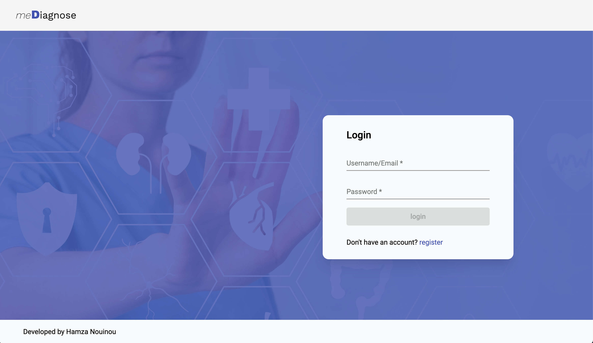
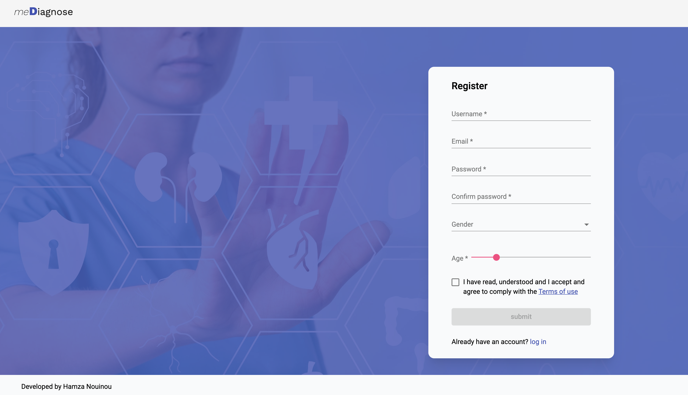
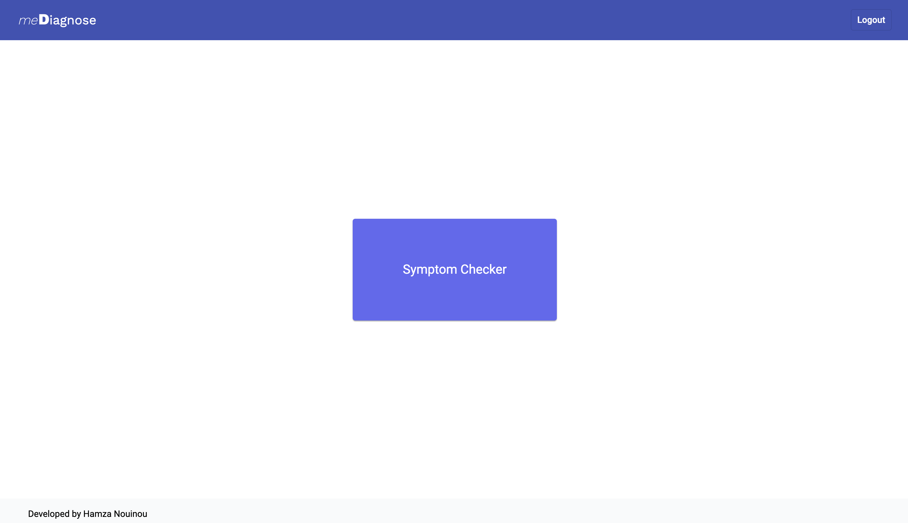
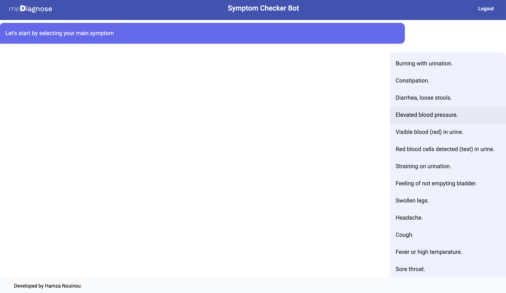
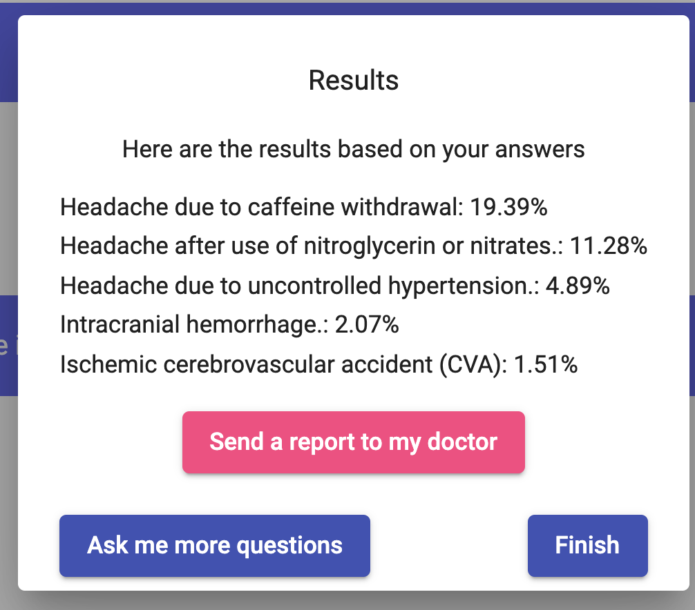
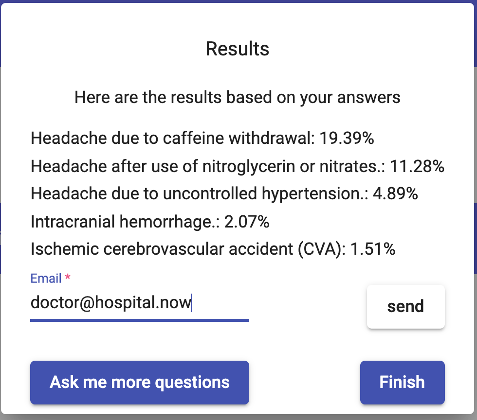
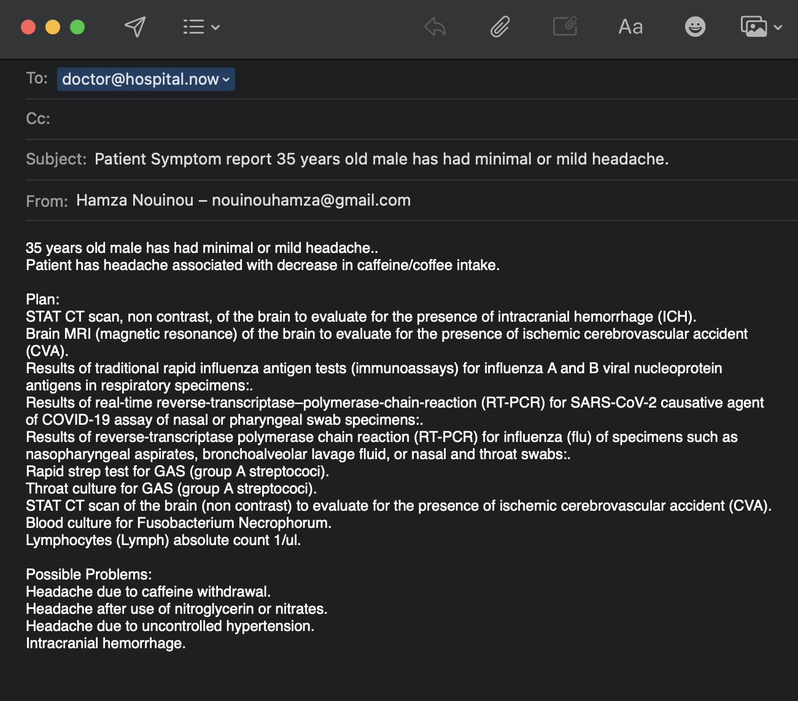

# MeDiagnose

### A symptom checker responsive web application developed using Angular and Express.

## Description

Hospitals similarly became flooded, as the number of COVID cases increased. MeDiagnose tried to help the individual patient to get an early self diagnosis by asking questions about the symptoms in a form of a conversation and communicate the results with his doctor.
It aims to help ease the hospital overcrowding problem by making the patient aware of what could be the issue from one side, and to make the doctor be aware of the symptoms that the patient have before the latest arrive to the hospital.

After 6 questions and answers, it displays a list of possible issues that the user may be suffering from with a percentage of each.
With each result, the user can generate an email to be sent to his doctor, ask for more questions (3 more times) or stop the session.

## How to Install and Run the Project
- Checkout [MeDiagnoseAPI](https://github.com/me-diagnose/mediagnose-api) for the backend side
- run `npm install` (use node 16 `nvm use 16`)
- run `npm run serve` or `ng serve` to serve the project to `localhost:4200`

## APIs and libraries used:
* [Endlessmedical](https://endlessmedical.com/about-endlessmedical-api/) API to generate questions and diagnosis.
* [Paypal checkout NodeJS SDK](https://github.com/paypal/Checkout-NodeJS-SDK) to make payment s
* [Angular Material](https://material.angular.io/)
* [Tailwind CSS](https://tailwindcss.com/)
* [JSON Web Token](https://github.com/auth0/node-jsonwebtoken)
* [MongoDB](https://www.mongodb.com/)

## Screenshots:

### Login/Welcome Page

### Registration Page

### Home Page

### Symptom checker Page

### Report Dialog

### Report Dialog with doctor's email

### Generated Email

